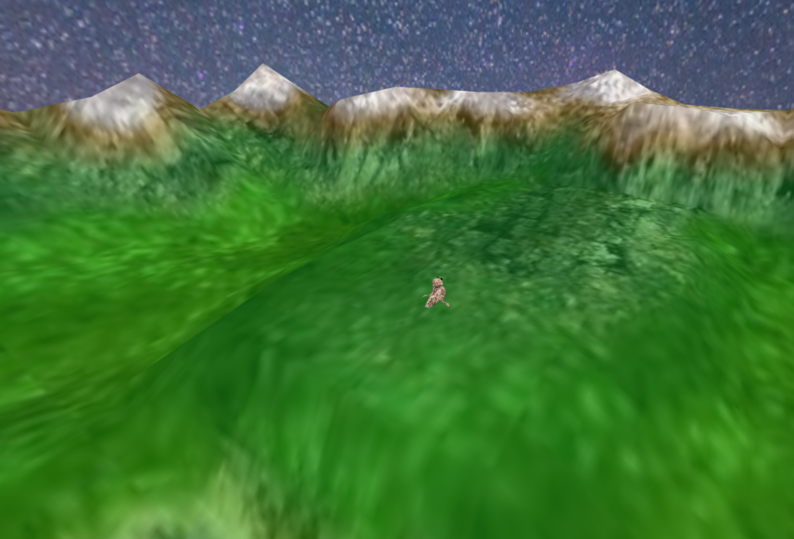
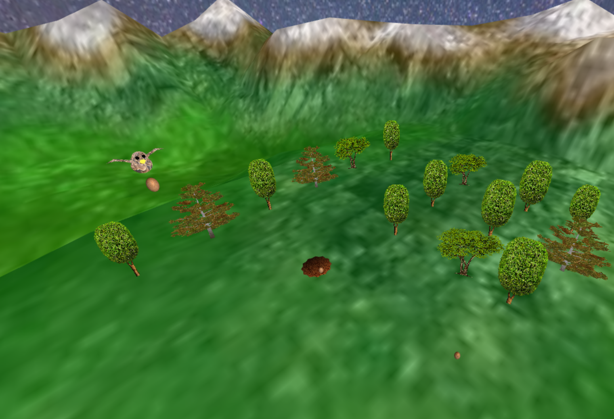
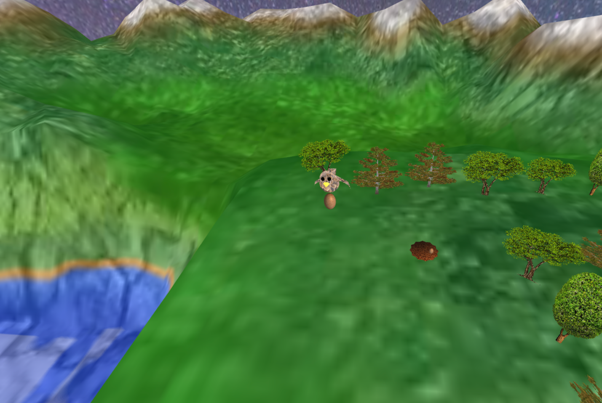
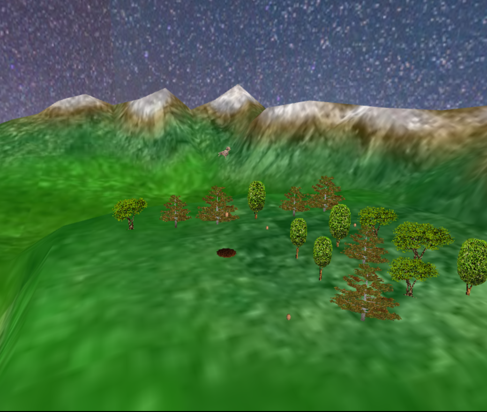

# CG 2022/2023

## Group T06G02

- Henrique Silva up202007242

- Tiago Branquinho up 202005567

## PROJECT Notes

- In exercise 1 we had some difficulties with the texture of the last slice of the sphere.

- In exercise 4 we had problems making the nest work on Mac as some texture coords were incorrectly done. The problem was solved successfully. 

- To catch the egg you need to press the key P and to drop it the key O.

- In exercise 6 we had some hardships making the threes rotate to follow the camera.

- In exercise 7 we implemented the egg falling parable.

*Panorama*

*Bird*

*Terrain*

*Nest and Eggs*

*Billboard Trees*

*Final Scene*

