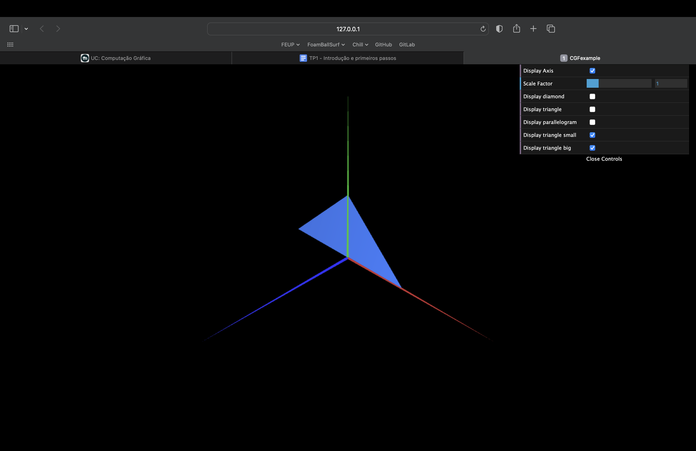

# CG 2022/2023

## Group T06G02

## TP 1 Notes

- In exercise 1, we had some difficulties at the beginning, regarding the interaction with the labels in the interface and the actual variables that controlled the display of specific items.
- We had no problems in exercise 2, since we just copied the logic of what we have done before.

