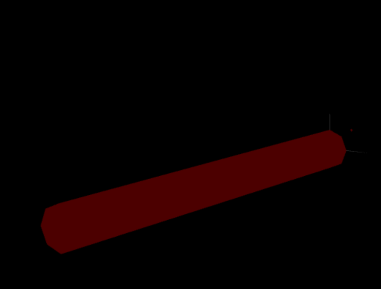

# CG 2022/2023

## Group T06G02

## TP 3 Notes

- In exercise 2 (Screenshot 3) and 3 (Screenshot 4), we had some difficulties finding each vertices normal, and defining the triangles that composed the main piece 

