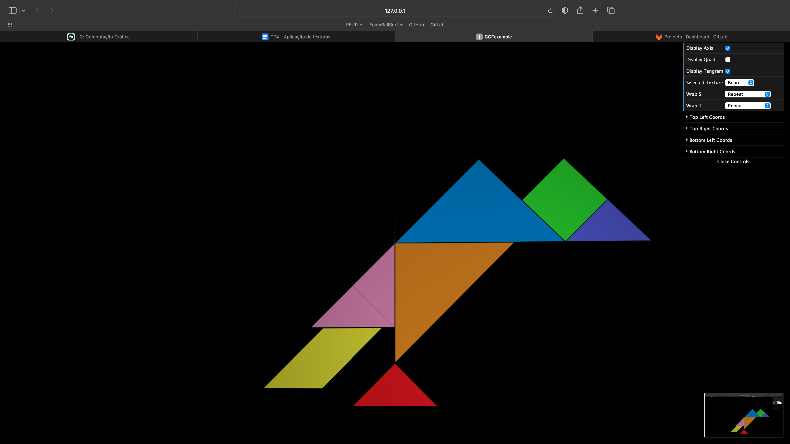
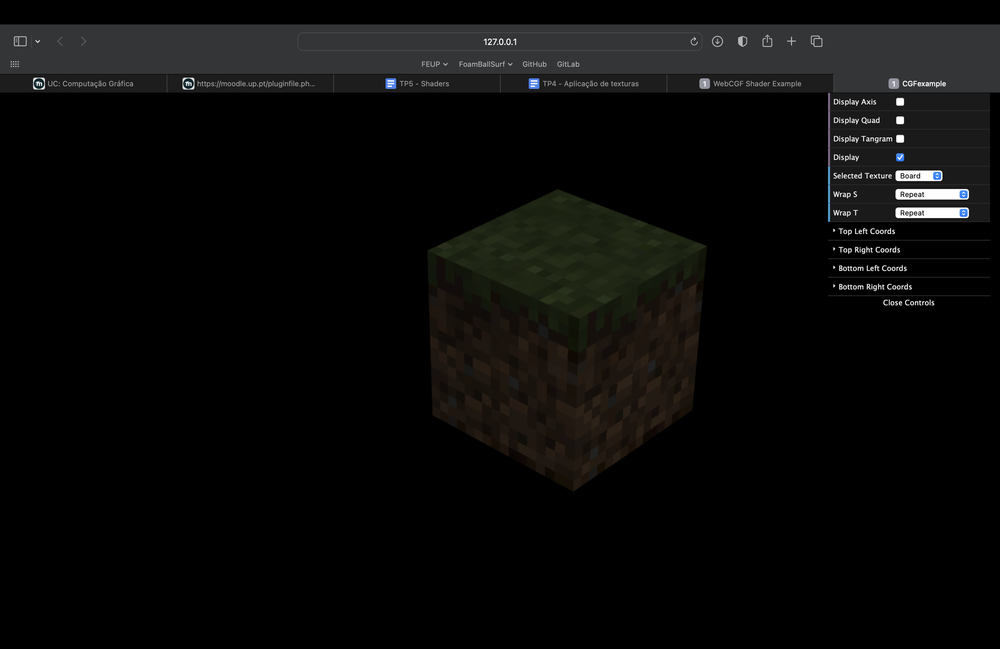

# CG 2022/2023

## Group T06G02

## TP 4 Notes

- In step 3 we had some difficulties on showing the parallelogram texture, since it was rotated around the z axis in our tangram (screenshot 1)

- In step 7 we had some difficulties on applying the right texture filter

